<picture>
  <!-- Dark mode -->
  <source media="(prefers-color-scheme: dark)" srcset="https://capsule-render.vercel.app/api?type=venom&color=6C63FF&height=200&section=header&text=Youssef%20Youssef&fontSize=70&fontColor=fff" />
  <!-- Light mode -->
  <source media="(prefers-color-scheme: light)" srcset="https://capsule-render.vercel.app/api?type=venom&color=6C63FF&height=200&section=header&text=Youssef%20Youssef&fontSize=70&fontColor=000" />

  
</picture>

<div align="center">
  


</div>

---

## ✒ About Me ️

> Passionate developer crafting solutions to complex problems.
> I believe bugs are intricate to programming, which, with time, we become better at resolving them.


- 📜 Currently working on **Bike Sharing System Web Application** 
- 🌱 Learning **Artificial Intelligence & Cloud Computing** 

---

## 🛠️ Tech Stack

<div align="center">

### Languages


### Frontend


### Backend


### Database & Cloud


</div>

---

## 📊 GitHub Statistics

<div align="center">


</div>

---

## 📈 Contribution Graph

<div align="center">

<picture>
  <source media="(prefers-color-scheme: dark)" srcset="https://raw.githubusercontent.com/Youssef8811/Youssef8811/output/github-contribution-grid-snake-dark.svg" />
  <source media="(prefers-color-scheme: light)" srcset="https://raw.githubusercontent.com/Youssef8811/Youssef8811/output/github-contribution-grid-snake.svg" />
  
</picture>


</div>

---

## 🎯 Current Focus

```javascript
const currentlyLearning = {
  cloud: ["AWS", "Azure", "Kubernetes"],
  ai: ["Machine Learning", "TensorFlow"],
  mobile: ["React Native"],
  blockchain: ["Solidity"]
};

const goals2025 = [
  "Contribute to an open source project",
  "Build and launch a SaaS product",
];
```

---

### 🌟 Featured Projects

<div align="center">
  
[](https://github.com/Moe1177/HexaPedal_HM)
[](https://github.com/POLO-SOEN341/POLO-SOEN341_Project_F24)

</div>

---

<div align="center">

**✨ Thanks for visiting!✨**

[](https://www.linkedin.com/in/-youssef-youssef/)
[](https://mail.google.com/mail/?view=cm&fs=1&to=youssefy8811@gmail.com)

</div>

<div align="center">

</div>

<div align="center">
  
</div>
